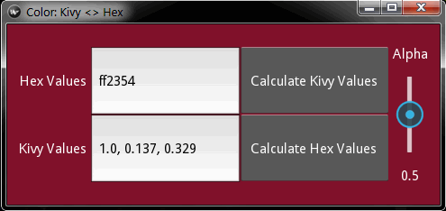
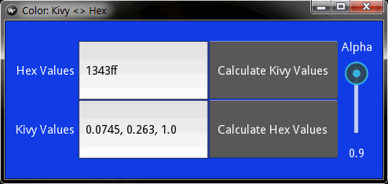

# KivyColor
#### A utility to convert Hex color values to kivy color values and vice-versa
  

#### Usage
To use it, input a value to either of the text input boxes and press the appropriate "Calculate" button.  
The Alpha slider doesn't change the values. It's there to help with the preview. 
